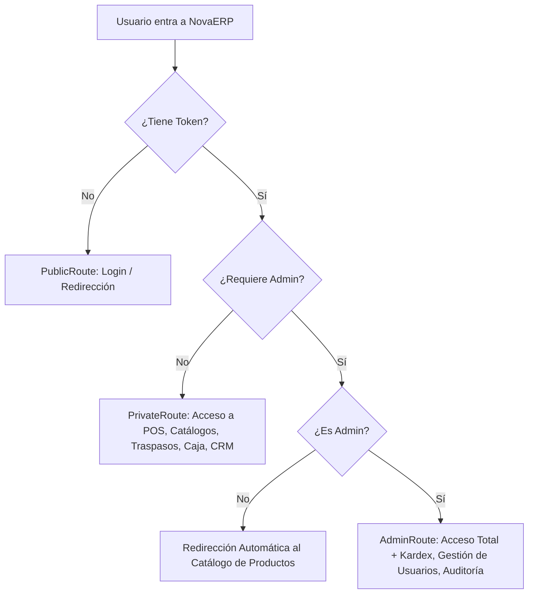

# Documentación Oficial de NovaERP
## Sistema Integral de Planificación de Recursos Empresariales (ERP)

Este documento contiene la documentación técnica y funcional completa del estado actual del proyecto **NovaERP**. El sistema está diseñado bajo una arquitectura desacoplada, con un backend robusto que funciona estrictamente como una **API RESTful** construida en **Laravel**, persistida en una base de datos relacional **Microsoft SQL Server**, y una interfaz de usuario interactiva (frontend) desarrollada con **React.js** y **Vite**.

---

## 1. Arquitectura General y Stack Tecnológico

El ecosistema de **NovaERP** se divide en dos componentes principales totalmente desacoplados:

### Backend (API RESTful)
*   **Framework:** Laravel 11+ / PHP 8.2+
*   **Base de Datos:** Microsoft SQL Server (SSMS) utilizando el controlador nativo de PHP `sqlsrv`.
*   **Autenticación y Seguridad:** Laravel Sanctum para la emisión y validación de tokens de API (`Bearer Tokens`).
*   **Esquema de Autorización:** Control de Accesos Basado en Roles (RBAC) integrado por medio de Middlewares personalizados.
*   **Características del Código:** Uso de Controladores dedicados, Form Requests para validación de datos de entrada, Resources de Eloquent para el formateo consistente de las respuestas JSON y transacciones de base de datos (`DB::beginTransaction`) para garantizar la atomicidad de las operaciones críticas.

### Frontend (Single Page Application - SPA)
*   **Tecnología Core:** React.js 18+ (Javascript)
*   **Herramientas de Construcción:** Vite (Entorno de desarrollo rápido y empaquetamiento optimizado)
*   **Enrutamiento:** React Router DOM v6 con guardianes de ruta jerárquicos (`PrivateRoute`, `AdminRoute`, `PublicRoute`).
*   **Estilos:** Hojas de estilos optimizadas (Vanilla CSS / App.css / index.css) diseñadas en **Modo Claro (Light Mode)** con una paleta de colores moderna en tonos grises e índigo (`slate-700`, `indigo-600`), soporte de colapsado dinámico y diseño responsivo.
*   **Manejo de Estado Global:** React Context API (`AuthContext`) para la persistencia del estado de autenticación de usuario.
*   **Consumo de API:** Axios configurado en una instancia centralizada (`api.js`) con interceptores para adjuntar automáticamente el Bearer Token guardado en el navegador (`localStorage`).

---

## 2. Modelado de Base de Datos (Esquema de Migraciones)

La estructura relacional de la base de datos de NovaERP se compone de migraciones que modelan los catálogos base, flujos de inventarios y transacciones del Punto de Venta:

### A. Gestión de Accesos e Identidades
*   `users`: Almacena el personal del sistema.
    *   Campos clave: `id`, `name`, `email`, `password`, `role` (`admin` o `empleado`), `activo` (booleano para inhabilitación rápida de accesos).
*   `personal_access_tokens`: Tabla nativa de Laravel Sanctum para gestionar sesiones multi-dispositivo activas.

### B. Inventario y Catálogos (Módulo 1)
*   `categorias`: Clasificación de productos (ej. Computación, Electrónica, Accesorios).
*   `marcas`: Fabricantes de los productos (ej. Lenovo, Samsung, Apple).
*   `productos`: Catálogo maestro de productos comercializables.
    *   Campos clave: `id`, `sku` (único, autogenerado secuencialmente `SKU-XXXXX`), `nombre`, `descripcion`, `precio_compra` (oculto para empleados), `precio_venta`, `stock_minimo`, `categoria_id`, `marca_id`, `activo`.
*   `almacenes`: Listado de sucursales físicas o bodegas (ej. Almacén Central, Sucursal Norte).
*   `producto_almacen`: Relación muchos a muchos para el control de inventario físico.
    *   Campos clave: `id`, `producto_id`, `almacen_id`, `stock_actual`.

### C. Kardex y Movimientos de Mercancía
*   `kardex_movimientos`: Bitácora inmutable de ingresos, egresos y ajustes manuales en almacenes.
    *   Campos clave: `id`, `producto_id`, `almacen_id`, `user_id`, `tipo` (`entrada_compra`, `salida_venta`, `entrada_ajuste`, `salida_ajuste`, `entrada_traspaso`, `salida_traspaso`), `cantidad`, `stock_anterior`, `stock_nuevo`, `motivo`, `referencia_documento`, `costo_unitario`.
*   `traspasos`: Control de traslados de mercancía entre diferentes almacenes (sucursales).
    *   Campos clave: `id`, `codigo_traspaso` (único, formato `TR-XXXXX`), `almacen_origen_id`, `almacen_destino_id`, `user_id` (remitente), `estado` (`pendiente`, `en_transito`, `recibido`, `rechazado`), `fecha_envio`, `fecha_recepcion`.
*   `traspaso_detalles`: Detalle de productos solicitados en cada traspaso.
    *   Campos clave: `id`, `traspaso_id`, `producto_id`, `cantidad`.

### D. Clientes, Ventas y Cotizaciones (Módulo 2 & CRM)
*   `clientes`: Directorio de clientes con perfil de facturación opcional.
    *   Campos clave: `id`, `nombre_razon_social`, `rfc`, `regimen_fiscal`, `uso_cfdi`, `codigo_postal_fiscal`, `direccion_fiscal_calle`, `direccion_fiscal_num_ext`, `direccion_fiscal_num_int`, `direccion_fiscal_colonia`, `direccion_fiscal_municipio`, `direccion_fiscal_estado`, `tipo_cliente`, `limite_credito`, `vendedor_id`.
*   `ventas`: Transacciones de cobro en el POS.
    *   Campos clave: `id`, `numero_ticket` (ej. V-2001), `sesion_caja_id`, `user_id` (cajero), `almacen_id`, `subtotal`, `iva`, `total`, `metodo_pago` (`efectivo`, `tarjeta`), `estado` (`completada`, `cancelada`).
*   `venta_detalles`: Artículos vendidos en la transacción.
    *   Campos clave: `id`, `venta_id`, `producto_id`, `cantidad`, `precio_unitario`, `subtotal`.
*   `cotizaciones`: Propuestas de venta que pueden ser presentadas a clientes y convertidas en ventas directas.
    *   Campos clave: `id`, `folio` (ej. COT-081), `cliente_id`, `vendedor_id`, `fecha_emision`, `fecha_vigencia`, `subtotal`, `iva`, `total`, `estado` (`borrador`, `vigente`, `vencida`, `convertida`), `observaciones`.
*   `cotizacion_detalles`: Artículos cotizados.
    *   Campos clave: `id`, `cotizacion_id`, `producto_id`, `cantidad`, `precio_unitario`, `descuento_porcentaje`, `total`.

### E. Flujo y Control de Caja (Turnos y Arqueos)
*   `cajas`: Puntos de cobro físicos asociados a almacenes específicos.
    *   Campos clave: `id`, `nombre`, `almacen_id`, `activo`.
*   `sesiones_caja`: Historial de aperturas y cierres de caja (turnos).
    *   Campos clave: `id`, `caja_id`, `user_id` (cajero), `fondo_inicial`, `efectivo_real` (declarado al cerrar), `descuadre` (diferencia monetaria calculada), `estado` (`abierta`, `cerrada`), `fecha_apertura`, `fecha_cierre`.

### F. Auditoría y Logs de Seguridad
*   `auditorias`: Bitácora inmutable que registra las operaciones críticas del sistema.
    *   Campos clave: `id`, `user_id` (ejecutor), `modulo` (`seguridad`, `usuarios`, `inventario`, `ventas`, `caja`, `clientes`, `cotizaciones`), `accion` (`LOGIN`, `LOGOUT`, `CREAR`, `EDITAR`, `ELIMINAR`, `APERTURA`, `CIERRE`, `CONFIRMAR`, `AJUSTE`), `severidad` (`info`, `warning`, `danger`), `descripcion`, `valores_anteriores` (JSON), `valores_nuevos` (JSON), `ip_address`, `user_agent`.

---

## 3. Inventario de Endpoints de la API Backend

A continuación, se listan los endpoints organizados por su respectiva capa de seguridad y middlewares asociados:

### A. Autenticación y Usuarios
| Método | Endpoint | Middleware | Descripción |
| :--- | :--- | :--- | :--- |
| `POST` | `/api/login` | *Público* | Inicia sesión del usuario y genera un Sanctum token. |
| `POST` | `/api/logout` | `auth:sanctum` | Revoca y destruye los tokens activos de la sesión actual. |
| `GET` | `/api/user` | `auth:sanctum` | Obtiene la información básica del usuario autenticado. |
| `POST` | `/api/register` | `auth:sanctum`, `role:admin` | Registra a un nuevo empleado con credenciales encriptadas. |
| `GET` | `/api/users` | `auth:sanctum`, `role:admin` | Retorna la lista total de usuarios en el sistema. |
| `PATCH` | `/api/users/{id}/toggle-status` | `auth:sanctum`, `role:admin` | Activa o desactiva la cuenta de un usuario específico. |

### B. Módulo de Inventario y Catálogo (Módulo 1)
| Método | Endpoint | Middleware | Descripción |
| :--- | :--- | :--- | :--- |
| `GET` | `/api/inventario/categorias` | `role:admin,empleado` | Lista todas las categorías registradas. |
| `GET` | `/api/inventario/categorias/{id}` | `role:admin,empleado` | Detalle de una categoría específica. |
| `POST` | `/api/inventario/categorias` | `role:admin` | Crea una nueva categoría. |
| `PUT/PATCH`| `/api/inventario/categorias/{id}` | `role:admin` | Modifica una categoría. |
| `DELETE` | `/api/inventario/categorias/{id}` | `role:admin` | Elimina una categoría. |
| `GET` | `/api/inventario/marcas` | `role:admin,empleado` | Lista marcas. |
| `POST` | `/api/inventario/marcas` | `role:admin` | Crea una marca. |
| `PUT/PATCH`| `/api/inventario/marcas/{id}` | `role:admin` | Modifica una marca. |
| `DELETE` | `/api/inventario/marcas/{id}` | `role:admin` | Elimina una marca. |
| `GET` | `/api/inventario/almacenes` | `role:admin,empleado` | Lista almacenes / sucursales. |
| `POST` | `/api/inventario/almacenes` | `role:admin` | Crea un almacén. |
| `PUT/PATCH`| `/api/inventario/almacenes/{id}` | `role:admin` | Modifica un almacén. |
| `DELETE` | `/api/inventario/almacenes/{id}` | `role:admin` | Elimina un almacén. |
| `GET` | `/api/inventario/productos` | `role:admin,empleado` | Consulta de productos con filtros de búsqueda y almacén (oculta `precio_compra` a empleados). |
| `POST` | `/api/inventario/productos` | `role:admin` | Crea un producto, genera SKU incremental, e inicializa stock por Kardex. |
| `PUT/PATCH`| `/api/inventario/productos/{id}` | `role:admin` | Edita datos y actualiza stock mediante Kardex. |
| `DELETE` | `/api/inventario/productos/{id}` | `role:admin` | Elimina un producto si no cuenta con movimientos registrados. |
| `POST` | `/api/inventario/kardex/ajustes` | `role:admin` | Registra una entrada, salida o corrección manual de stock. |
| `GET` | `/api/inventario/kardex` | `role:admin` | Historial total de movimientos de stock. |
| `GET` | `/api/inventario/traspasos` | `role:admin,empleado` | Historial de traspasos entre almacenes. |
| `POST` | `/api/inventario/traspasos` | `role:admin,empleado` | Crea una orden de traspaso en tránsito. |
| `POST` | `/api/inventario/traspasos/{id}/confirmar`| `role:admin,empleado` | Confirma o rechaza el traspaso en sucursal destino afectando Kardex y existencias. |

### C. Módulo de Punto de Venta (POS) y Turnos (Módulo 2)
| Método | Endpoint | Middleware | Descripción |
| :--- | :--- | :--- | :--- |
| `GET` | `/api/pos/ventas` | `role:admin,empleado` | Historial de ventas de la sucursal actual. |
| `POST` | `/api/pos/ventas` | `role:admin,empleado` | Procesa y confirma una venta actualizando stock e integrando a la caja abierta. |
| `GET` | `/api/pos/siguiente-ticket` | `role:admin,empleado` | Genera y predice el número consecutivo para la venta. |
| `GET` | `/api/caja/sesion-activa` | `role:admin,empleado` | Verifica si el usuario cuenta con un turno de cobro abierto en el navegador. |
| `GET` | `/api/caja/cajas-disponibles`| `role:admin,empleado` | Retorna cajas inactivas listas para apertura. |
| `POST` | `/api/caja/apertura` | `role:admin,empleado` | Inicia sesión de caja asignando el fondo inicial. |
| `GET` | `/api/caja/cierre-resumen` | `role:admin,empleado` | Estadísticas del turno (total efectivo, tarjeta, balance, inventario). |
| `POST` | `/api/caja/cierre` | `role:admin,empleado` | Cierra caja calculando el descuadre con el dinero físico contado. |

### D. CRM Clientes y Cotizaciones
| Método | Endpoint | Middleware | Descripción |
| :--- | :--- | :--- | :--- |
| `GET` | `/api/clientes` | `role:admin,empleado` | Lista clientes en el sistema. |
| `POST` | `/api/clientes` | `role:admin,empleado` | Crea un cliente (con validaciones de RFC y datos fiscales). |
| `PUT/PATCH`| `/api/clientes/{id}` | `role:admin,empleado` | Edita datos del cliente. |
| `DELETE` | `/api/clientes/{id}` | `role:admin,empleado` | Elimina un cliente. |
| `GET` | `/api/cotizaciones` | `role:admin,empleado` | Historial de cotizaciones emitidas. |
| `POST` | `/api/cotizaciones` | `role:admin,empleado` | Crea una nueva cotización. |
| `PUT/PATCH`| `/api/cotizaciones/{id}` | `role:admin,empleado` | Edita una cotización. |
| `DELETE` | `/api/cotizaciones/{id}` | `role:admin,empleado` | Elimina/cancela una cotización. |
| `PATCH` | `/api/cotizaciones/{id}/convertir`| `role:admin,empleado` | Convierte una cotización en venta real procesando stocks y tickets en el POS. |

### E. Módulo de Auditoría y Seguridad
| Método | Endpoint | Middleware | Descripción |
| :--- | :--- | :--- | :--- |
| `GET` | `/api/auditoria` | `auth:sanctum`, `role:admin` | Retorna la bitácora de auditorías con filtros por búsqueda, módulo, severidad y rango de fechas. |

### F. Módulo de Indicadores y Dashboard (Módulo 4)
| Método | Endpoint | Middleware | Descripción |
| :--- | :--- | :--- | :--- |
| `GET` | `/api/dashboard` | `auth:sanctum` | Obtiene las agregaciones y datos para las gráficas de ventas e indicadores diarios. |

---

## 4. Enrutamiento y Páginas del Frontend

El frontend está estructurado en torno a un archivo centralizador de rutas ([App.jsx](file:///c:/Users/manue/OneDrive/Documentos/5%20Cuatri/NovaERP/frontend/src/App.jsx)) que aplica tres niveles de restricciones visuales (Guardianes):



### Rutas Frontend Declaradas
1.  **Públicas:**
    *   `/login`: Pantalla de autenticación y captura de credenciales ([LoginPage.jsx](file:///c:/Users/manue/OneDrive/Documentos/5%20Cuatri/NovaERP/frontend/src/pages/LoginPage.jsx)).
2.  **Protegidas (Generales - Admin y Empleado):**
    *   `/dashboard`: Métricas, resúmenes rápidos del ERP ([DashboardPage.jsx](file:///c:/Users/manue/OneDrive/Documentos/5%20Cuatri/NovaERP/frontend/src/pages/DashboardPage.jsx)).
    *   `/pos`: Punto de Venta activo con buscador, carrito de compras, cobro e impresión de tickets ([PuntoVentaPage.jsx](file:///c:/Users/manue/OneDrive/Documentos/5%20Cuatri/NovaERP/frontend/src/pages/PuntoVentaPage.jsx)).
    *   `/inventario/productos`: Vista del catálogo de productos. Si el rol es empleado, cambia su comportamiento a modo consulta (solo lectura, oculta `precio_compra` y bloquea botones de añadir/editar/eliminar) ([ProductosPage.jsx](file:///c:/Users/manue/OneDrive/Documentos/5%20Cuatri/NovaERP/frontend/src/pages/ProductosPage.jsx)).
    *   `/inventario/traspasos`: Creación y aprobación de traspasos entre almacenes ([AuditoriaTraspasosPage.jsx](file:///c:/Users/manue/OneDrive/Documentos/5%20Cuatri/NovaERP/frontend/src/pages/AuditoriaTraspasosPage.jsx)).
    *   `/cotizaciones`: Gestión y conversión de cotizaciones a ventas en el POS ([CotizacionesPage.jsx](file:///c:/Users/manue/OneDrive/Documentos/5%20Cuatri/NovaERP/frontend/src/pages/CotizacionesPage.jsx)).
    *   `/clientes`: Catálogo de CRM para registro y edición de clientes ([ClientesPage.jsx](file:///c:/Users/manue/OneDrive/Documentos/5%20Cuatri/NovaERP/frontend/src/pages/ClientesPage.jsx)).
    *   `/cierre-caja`: Vista para cierres de turno, con métricas de arqueo y cálculo de descuadres ([CierreCajaPage.jsx](file:///c:/Users/manue/OneDrive/Documentos/5%20Cuatri/NovaERP/frontend/src/pages/CierreCajaPage.jsx)).
    *   `/operaciones`: Página general de tareas y consultas operativas del personal ([EmployeePage.jsx](file:///c:/Users/manue/OneDrive/Documentos/5%20Cuatri/NovaERP/frontend/src/pages/EmployeePage.jsx)).
3.  **Administrativas (Exclusivas - Solo Admin):**
    *   `/register`: Formulario de alta para nuevos usuarios ([RegisterPage.jsx](file:///c:/Users/manue/OneDrive/Documentos/5%20Cuatri/NovaERP/frontend/src/pages/RegisterPage.jsx)).
    *   `/usuarios`: Lista, edición y toggle de activación para el personal ([UsuariosPage.jsx](file:///c:/Users/manue/OneDrive/Documentos/5%20Cuatri/NovaERP/frontend/src/pages/UsuariosPage.jsx)).
    *   `/inventario/kardex`: Auditoría completa de movimientos de inventario y ajustes de stock directos ([KardexPage.jsx](file:///c:/Users/manue/OneDrive/Documentos/5%20Cuatri/NovaERP/frontend/src/pages/KardexPage.jsx)).
    *   `/auditoria`: Logs del sistema y registros de auditoría operativa general ([AuditoriaPage.jsx](file:///c:/Users/manue/OneDrive/Documentos/5%20Cuatri/NovaERP/frontend/src/pages/AuditoriaPage.jsx)).

---

## 5. Lógica de Negocio y Funcionalidades Destacadas

### A. Seguridad y Restricción Dinámica de Precios (RBAC)
*   **En el Backend:** El archivo `ProductoController` utiliza un recurso especializado `ProductoResource` que detecta el rol del usuario autenticado vía middleware. Si el usuario logueado tiene el rol de `empleado`, la API remueve dinámicamente el campo `precio_compra` de la respuesta JSON para que la información financiera confidencial nunca viaje por la red.
*   **En el Frontend:** El componente `Navigation` filtra los menús automáticamente. Si un empleado intenta tipear `/inventario/kardex` o `/usuarios` en la URL, el guardián `AdminRoute` intercepta la acción y lo redirige automáticamente a la consulta de productos de lectura.

### B. Proceso de Traspasos entre Almacenes en Dos Fases
Para evitar pérdidas de stock y errores humanos, los traspasos se efectúan bajo un esquema de solicitud y verificación:
1.  **Fase de Solicitud (Creación):** Cualquier empleado o administrador puede seleccionar un almacén origen, un almacén destino y agregar productos con las cantidades a trasladar. El traspaso se guarda con estado `pendiente` y no altera el stock físico de ninguno de los dos almacenes.
2.  **Fase de Confirmación (Aprobación):** El usuario en la sucursal de destino recibe físicamente la mercancía y da clic en "Confirmar". En este instante, el backend ejecuta una transacción SQL para:
    *   Restar el stock del almacén de origen.
    *   Sumar el stock en el almacén de destino.
    *   Cambiar el estado del traspaso a `confirmado`.
    *   Registrar de forma inmutable el movimiento en la bitácora de Kardex.

### C. Punto de Venta (POS) Interconectado con Sesión de Caja
*   **Apertura del Turno:** Antes de permitir realizar ventas, el sistema comprueba si el cajero posee una sesión abierta. Si no es así, bloquea la pantalla con un modal obligatorio para seleccionar la Sucursal y definir el Fondo de Caja Inicial.
*   **Carrito Inteligente:** Al agregar productos, el carrito de compras del POS comprueba en tiempo real las existencias disponibles de la sucursal asignada a la caja abierta. Si el cajero intenta superar el stock actual, el sistema lo bloquea arrojando una alerta visual.
*   **CRM Integrado:** El POS permite asociar un cliente específico de la base de datos o dejarlo como "Público General". Al seleccionar un cliente, el sistema lee los metadatos y muestra visualmente una etiqueta verde (`🟢 Facturación Lista`) si el perfil fiscal está completo (RFC, Régimen y C.P.), o amarilla (`🟡 Perfil Incompleto`) si carece de datos fiscales básicos.
*   **Flujo de Cotizaciones:** Si el cliente tiene una cotización guardada previamente, el cajero puede dar clic en "Convertir a venta" en el módulo de cotizaciones, lo cual precarga de manera automática los productos y el cliente en la pantalla del POS para agilizar el cobro.

### D. Cierre de Caja y Arqueo (Arqueo con Descuadre)
Al final del día laboral, el cajero accede a la pantalla de Cierre de Caja. El backend recopila todos los eventos transaccionales desde la hora de la apertura:
*   Monto de ventas pagadas en efectivo y con tarjeta.
*   Fondo inicial de apertura.
*   Monto de tickets cancelados.
*   **Cálculo:** `Efectivo Esperado = Fondo Inicial + Total Ventas Efectivo`.
*   El cajero cuenta físicamente el dinero en caja y escribe el valor en la pantalla (`Efectivo Real`). El sistema calcula inmediatamente el descuadre (`Diferencia = Efectivo Real - Efectivo Esperado`), registrando sobrantes (número positivo) o faltantes (número negativo) en la tabla `sesiones_caja` para auditorías posteriores.

### E. Gráficos Visuales y Dashboards Interactivos (Módulo 4)
*   **Gráfica de Ventas Semanales (Líneas Bézier Cúbicas)**: Desarrollamos un algoritmo de Catmull-Rom para conectar los puntos de venta fluidamente mediante curvas SVG. Incluye degradado de fondo, grid horizontal, tooltips flotantes en hover, y una animación que dibuja el trazo progresivamente de izquierda a derecha.
*   **Gráfica de Reparto por Categorías (Donut Reactivo)**: Gráfico de anillos reactivo calculado mediante `strokeDashoffset` con leyendas dinámicas y colores armoniosos. Incorpora una separación visual constante de 5px entre segmentos y animación secuencial de dibujado de segmentos.
*   **Bitácora y Detalle de Logs en Auditoría**: El panel de auditorías ofrece filtros combinados y una vista modal para inspeccionar cambios (valores anteriores y valores nuevos) en formato JSON estructurado, facilitando la trazabilidad.

---

## 6. Guía de Ejecución y Despliegue Local

### Requisitos Previos
*   **PHP 8.2 o superior** con las extensiones `pdo`, `sqlsrv` y `pdo_sqlsrv` habilitadas en el `php.ini`.
*   **Composer** (Gestor de dependencias de PHP).
*   **Node.js 18 o superior** y **npm**.
*   **Microsoft SQL Server** configurado en puerto por defecto (1433) y con autenticación habilitada.

### Levantamiento del Backend
1.  Navegar a la carpeta del backend:
    ```bash
    cd backend
    ```
2.  Instalar las dependencias de Composer:
    ```bash
    composer install
    ```
3.  Configurar las variables de entorno:
    *   Duplicar `.env.example` y renombrarlo a `.env`.
    *   Configurar las credenciales de SQL Server:
        ```env
        DB_CONNECTION=sqlsrv
        DB_HOST=127.0.0.1
        DB_PORT=1433
        DB_DATABASE=NovaERP
        DB_USERNAME=tu_usuario_sql
        DB_PASSWORD=tu_contrasena_sql
        ```
4.  Ejecutar las migraciones y seeders para poblar datos base:
    ```bash
    php artisan migrate --seed
    ```
5.  Iniciar el servidor de desarrollo local:
    ```bash
    php artisan serve
    ```

### Levantamiento del Frontend
1.  Navegar a la carpeta del frontend:
    ```bash
    cd ../frontend
    ```
2.  Instalar dependencias de Node:
    ```bash
    npm install
    ```
3.  Configurar la ruta base de la API en `src/services/api.js` (apuntando al host local del backend, por ejemplo `http://127.0.0.1:8000/api`).
4.  Ejecutar el servidor de desarrollo de Vite:
    ```bash
    npm run dev
    ```
